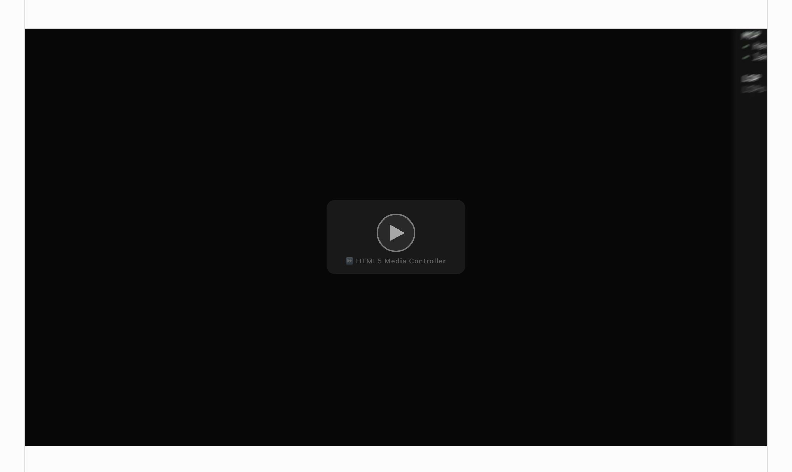
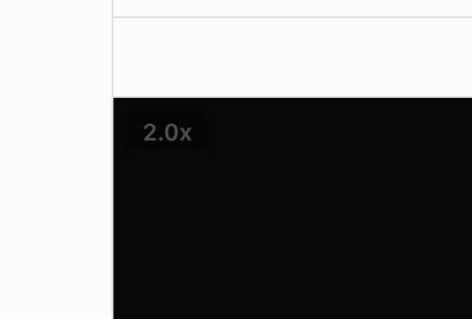
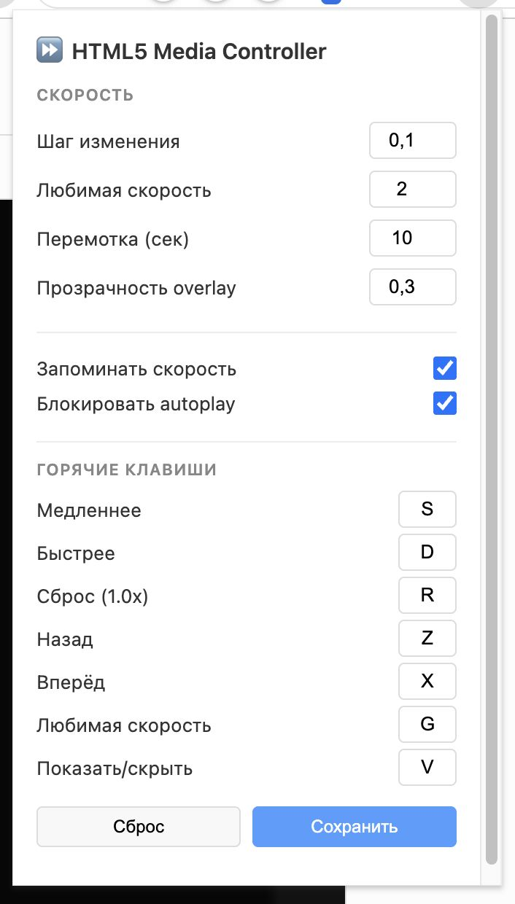

# HTML5 Media Controller

Chrome extension that blocks HTML5 autoplay and adds playback speed control for all video/audio elements. Features keyboard shortcuts, speed overlay, play/pause button, and customizable settings. Manifest V3.

Inspired by [Video Speed Controller](https://github.com/igrigorik/videospeed) — a great extension for speed control, but it doesn't block autoplay. I wanted both features in a single extension without installing two separate ones, so I built this.

---

Навибрировал себе HTML5 Media Controller Chrome Extension, потому что https://chromewebstore.google.com/detail/disable-html5-autoplay/efdhoaajjjgckpbkoglidkeendpkolai пришел конец, а ставить абы что из стора нет никакого желания.

---

## Screenshots

### Autoplay заблокирован — play/pause button overlay


### Speed control overlay + keyboard shortcuts


### Попап настроек расширения


---

## Содержание

- [Возможности](#возможности)
- [Screenshots](#screenshots)
- [Как это работает](#как-это-работает)
- [Исключения сайтов](#исключения-сайтов)
- [Горячие клавиши](#горячие-клавиши)
- [Установка](#установка)
- [Настройка](#настройка)
- [Тестирование](#тестирование)
- [Статическая проверка](#статическая-проверка)
- [Структура файлов](#структура-файлов)
- [Ограничения](#ограничения)

---

## Возможности

**Блокировка autoplay:**
- Блокирует автовоспроизведение видео и аудио на всех страницах
- Перехватывает программные вызовы `element.play()` без user gesture
- Удаляет атрибут `autoplay` из DOM
- Отслеживает динамически добавленные элементы (SPA, lazy loading)
- Позволяет отключить блокировку autoplay для отдельных сайтов
- Поддерживает исключения только для exact host или для host вместе с поддоменами

**Управление скоростью (по аналогии с videospeed):**
- Overlay-индикатор текущей скорости на каждом видео
- Диапазон скорости: 0.1x — 16x с настраиваемым шагом (по умолчанию 0.1)
- Горячие клавиши: ускорение, замедление, сброс, перемотка, preferred speed
- Scroll wheel на overlay меняет скорость
- Запоминание скорости между перезагрузками
- Автовосстановление скорости если сайт пытается сбросить playbackRate
- Настраиваемая "любимая" скорость (переключение одной клавишей)
- Popup с настройками (клавиши, шаг, opacity, preferred speed)

## Как это работает

### Архитектура

Расширение использует три скрипта с разными ролями:

| Скрипт | World | Назначение |
|--------|-------|-----------|
| `content.js` | ISOLATED | Блокировка autoplay + мост настроек chrome.storage → MAIN world |
| `speed-controller.js` | MAIN | Overlay, горячие клавиши, управление playbackRate |
| `main-world.js` | MAIN | Monkey-patch `play()` для блокировки programmatic autoplay |

**Зачем два world:**
- **ISOLATED** — доступ к `chrome.storage` API (настройки). Не видит JS-контекст страницы.
- **MAIN** — доступ к `HTMLMediaElement.prototype.play()` и `playbackRate`. Не видит chrome API.

**Мост настроек:**
`content.js` читает настройки из `chrome.storage.sync`, локальные исключения из `chrome.storage.local` и передаёт effective-настройки в MAIN world через `CustomEvent`. Это позволяет менять настройки в popup без перезагрузки страницы.

### Блокировка autoplay (content.js + main-world.js)

1. **Атрибут autoplay** — `content.js` через MutationObserver снимает атрибут и паузит элемент
2. **Программный play()** — `main-world.js` подменяет `HTMLMediaElement.prototype.play()`, блокирует вызовы без user gesture
3. **Страховка** — `content.js` слушает событие `play` на document, проверяет `navigator.userActivation`

Глобальный переключатель **"Блокировать autoplay"** и исключения сайтов сводятся в один effective-флаг. Если глобальная блокировка выключена или текущий hostname попадает в исключение, `content.js` не снимает autoplay, а `main-world.js` вызывает оригинальный `play()`.

### Исключения сайтов

Исключения хранятся локально, под ключом `autoplaySiteExceptions` в `chrome.storage.local`. Они не синхронизируются между устройствами и не очищаются кнопкой **"Сброс"** в popup.

Формат элемента:

```js
{
  host: 'example.com',
  includeSubdomains: true,
  createdAt: 1770000000000
}
```

Матчинг:

- `includeSubdomains: false` — только `hostname === host`
- `includeSubdomains: true` — `hostname === host` или `hostname.endsWith("." + host)`

### Speed Controller (speed-controller.js)

1. **MutationObserver** обнаруживает `<video>`/`<audio>` в DOM
2. Для каждого создаёт `SpeedController` — overlay + обработчики
3. **Overlay** (`<vsc-overlay>`) позиционируется поверх видео, показывает текущую скорость
4. **ratechange listener** ловит попытки сайта сбросить скорость и восстанавливает
5. Скорость хранится в `localStorage` (доступен в MAIN world)

## Горячие клавиши

Все клавиши настраиваемые через popup. По умолчанию:

| Клавиша | Действие |
|---------|----------|
| **S** | Уменьшить скорость (−0.1) |
| **D** | Увеличить скорость (+0.1) |
| **R** | Сбросить на 1.0x |
| **Z** | Перемотка назад (−10 сек) |
| **X** | Перемотка вперёд (+10 сек) |
| **G** | Переключить на preferred speed (2.0x) / обратно |
| **V** | Показать / скрыть overlay |

Горячие клавиши **не работают** когда:
- Фокус в поле ввода (input, textarea, contenteditable)
- Зажат модификатор (Ctrl, Alt, Cmd)

**Scroll wheel** на overlay меняет скорость на ±0.1 за тик.

**Двойной клик** на overlay сбрасывает скорость на 1.0x.

## Установка

### 1. Скачать

```bash
git clone https://github.com/tttptd/html5-media-controller
# или скачать ZIP и распаковать
```

### 2. Открыть страницу расширений

Введите в адресной строке Chrome:

```
chrome://extensions
```

### 3. Включить Developer mode

Переключатель **"Режим разработчика"** в правом верхнем углу страницы.

### 4. Загрузить расширение

1. Нажмите **"Загрузить распакованное расширение"** (Load unpacked)
2. Выберите директорию `html5-video` (ту, где `manifest.json`)
3. Расширение появится в списке

### 5. Проверить

Откройте страницу с видео. В DevTools → Console должны появиться:

```
[HTML5 Media Controller] Content script loaded
[HTML5 Media Controller] Speed controller loaded — текущая скорость: 1.0x
[Autoplay Blocker] Main world script loaded — play() перехвачен
```

## Настройка

Кликните на иконку расширения → откроется popup с настройками:

**Скорость:**
- Шаг изменения (по умолчанию 0.1)
- Любимая скорость (по умолчанию 2.0x)
- Шаг перемотки в секундах (по умолчанию 10)
- Прозрачность overlay (по умолчанию 0.3)

**Переключатели:**
- Запоминать скорость между перезагрузками
- Блокировать autoplay (можно отключить, оставив только speed controller)

**Исключения autoplay:**
- Popup показывает hostname текущей вкладки, если его можно определить
- Кнопка добавляет или удаляет правило для текущего hostname
- Режим **"Только этот сайт"** применяет правило только к exact host
- Режим **"Сайт и поддомены"** применяет правило к host и всем его поддоменам
- Список исключений доступен даже на служебных страницах без hostname

**Горячие клавиши:**
- Кликните по полю и нажмите нужную клавишу
- Нажмите "Сохранить" — настройки применяются мгновенно ко всем вкладкам

## Тестирование

### Тест autoplay

Создайте HTML-файл:

```html
<!DOCTYPE html>
<html>
<body>
  <h1>Autoplay Test</h1>
  <video autoplay muted loop width="400">
    <source src="https://www.w3schools.com/html/mov_bbb.mp4" type="video/mp4">
  </video>

  <h2>Programmatic play</h2>
  <video id="vid2" muted width="400">
    <source src="https://www.w3schools.com/html/mov_bbb.mp4" type="video/mp4">
  </video>
  <script>
    document.getElementById('vid2').play().catch(e => {
      console.log('Autoplay blocked:', e.message);
    });
  </script>
</body>
</html>
```

Оба видео должны быть на паузе.

### Тест speed controller

1. Откройте YouTube или любую страницу с видео
2. Запустите видео вручную (клик play)
3. Нажмите **D** несколько раз — скорость растёт, overlay показывает текущую
4. Нажмите **S** — скорость падает
5. Нажмите **R** — сброс на 1.0x
6. Нажмите **G** — переключение на 2.0x
7. Наведите мышь на overlay, крутите колесо — скорость меняется
8. Нажмите **V** — overlay скрыт/показан

### Чеклист

| Сценарий | Ожидание |
|----------|----------|
| `blockAutoplay = false` | DOM-атрибут autoplay и `element.play()` не блокируются |
| `blockAutoplay = true`, сайт не в исключениях | Autoplay блокируется как обычно |
| Добавить текущий hostname в исключения | Autoplay на этом hostname не блокируется |
| Удалить текущий hostname из исключений | Блокировка снова работает |
| Исключение с поддоменами | Работает для host и `*.host` |
| Перезагрузка popup или страницы | Список исключений сохраняется |
| `chrome://` или страница без hostname | Управление текущим сайтом выключено, список доступен |
| `<video autoplay>` | Видео на паузе |
| `element.play()` без клика | Заблокировано |
| Клик по play | Воспроизведение работает |
| SPA-навигация | Новое видео тоже контролируется |
| Горячие клавиши в input | Не перехватываются |
| Перезагрузка страницы | Скорость восстановлена |
| Сайт сбрасывает playbackRate | Скорость восстановлена |
| Изменение настроек в popup | Применяются без перезагрузки |

### Статическая проверка

```bash
git diff --check
```

## Структура файлов

```
html5-video/
├── manifest.json          — Manifest V3, content scripts, popup
├── content.js             — Autoplay blocker + мост настроек
├── speed-controller.js    — Speed overlay, горячие клавиши, playbackRate
├── main-world.js          — Monkey-patch play() для блокировки autoplay
├── popup/
│   ├── popup.html         — UI настроек
│   └── popup.js           — Логика popup (chrome.storage.sync + chrome.storage.local)
├── icons/
│   ├── icon16.png         — 16×16
│   ├── icon48.png         — 48×48
│   └── icon128.png        — 128×128
├── README.md              — Этот файл
└── PLAN.md                — План разработки
```

## Ограничения

1. **Muted autoplay** — Chrome разрешает autoplay для muted видео. Расширение блокирует и его — может сломать фоновые анимации.

2. **Closed Shadow DOM** — MutationObserver не проникает внутрь closed Shadow DOM. Видео внутри закрытых Shadow DOM не контролируются.

3. **`new Audio()`** — аудио созданное через `new Audio()` и не добавленное в DOM не отслеживается overlay (но play() всё равно перехватывается main-world.js).

4. **Конфликты клавиш** — некоторые сайты используют те же клавиши (S на YouTube = субтитры). Расширение перехватывает их в capture phase. Если мешает — смените клавиши в popup.

5. **Иконки** — сгенерированы программно (красный круг с паузой). Для продакшена стоит заменить на профессиональные.
